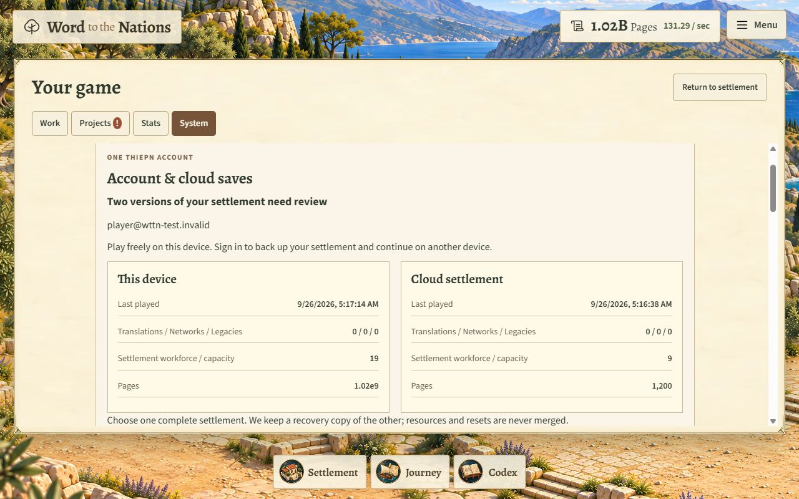
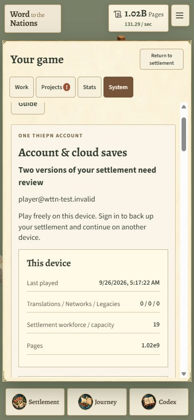

# v2.11.0 account integration verification

Status: **implemented and staged; real-account release gate remains open.** The owner confirmed that the central account interface is still being built. The live game has not been promoted to this release.

## Implemented

- Shared THIEPN SDK integration with Google as the sole game sign-in entry point.
- Optional private cloud saves, revision conflicts, retry idempotency, five recovery snapshots and explicit cloud-data deletion.
- Verified guest/account slots, recoverable account switches and single active game-tab protection.
- Account panel, conflict comparison, cloud recovery downloads and corrected privacy/save descriptions.
- App registration and private database migration applied in the existing canonical Supabase project. The local migration filename matches the recorded database version `20260926030207`.
- Pinned dependency/lockfile, content-hashed static build and account consumer conformance workflow.

## Measured checks

| Check | Result |
|---|---|
| Existing and new release suites | 38/38 passed; 64.64 seconds in the recorded local run |
| Cloud synchronization scenarios | 18 passed |
| Local save-storage regression groups | 12 passed |
| Static delivery checks | 15 passed |
| THIEPN consumer conformance | Passed against pinned platform release |
| Economic engine, numeric engine, save-format and full-backup modules | Unchanged from v2.10.4 |
| Economic parity | Existing v2.9 command traces passed, including approaches, reset layers and 1h/8h/1d/7d offline intervals |
| Initial playable bytes | 3,859,649 |
| Detailed desktop / phone bytes | 8,787,265 / 5,462,493 |
| Optimized artwork bytes | 33,287,230; unchanged |

The initial full-suite run exposed version assertions still expecting v2.10.4 and a save-test harness missing the new optional account adapter. Those fixtures were updated for v2.11.0; economic expectations and timing thresholds were not relaxed. Final delivery/account checks were rerun after the last interface changes.

## Database verification

`tests/cloud-database.sql` passed on the canonical database using synthetic users inside one rolled-back transaction. Checks cover owner isolation, anonymous denial, denial of direct table access, stale revisions, idempotent retries, five-snapshot retention, deletion markers, explicit re-enabling, deleted identities and payload limits.

After testing: **zero synthetic users, zero WTTN live saves and zero WTTN history rows**. No real player progress was accessed or changed. Supabase security advisors reported no WTTN findings; existing unrelated project advisories remain outside this change.

## Browser verification

Tested in the Codex in-app Chromium browser on Windows using local builds:

- Canonical shared SDK loads and displays the guest state.
- Local mock account: meaningful guest progress triggers a local/cloud comparison; choosing the cloud copy loads its nine-scribe settlement; signing out restores the guest's thirteen scribes and six copyists.
- Confirmation dialog, separate guest/account state and readable cloud status verified through actual UI controls.
- A second tab waits; closing the active tab automatically resumes the waiting tab with preserved progress.
- Desktop 1280×800, phone 390×844 and narrow 320×568 checked. No document horizontal overflow in the checked phone layouts. Keyboard focus remained visible on account disclosures.
- No browser warning/error logs during the mock account flow.

Screenshots use a deliberately fake account and local cloud fixture, not Google authentication:

## Outstanding before production promotion

- Finish the central THIEPN account UI and provide its management URL.
- Verify the Google provider and exact game callback allowlist, then test real shared sign-in/sign-out with designated accounts.
- Test real cross-device synchronization, session expiry and central account deletion end to end. Database permissions and deletion behavior are tested, but simulated JWT identities are not a substitute for an actual OAuth flow.
- Physical Android/iOS, Firefox, Safari, an actual screen reader and true browser 200% zoom were not tested in this run.

Do not merge the draft release into `main` until the real-account gates pass. Guest play remains available independently of the account service.
